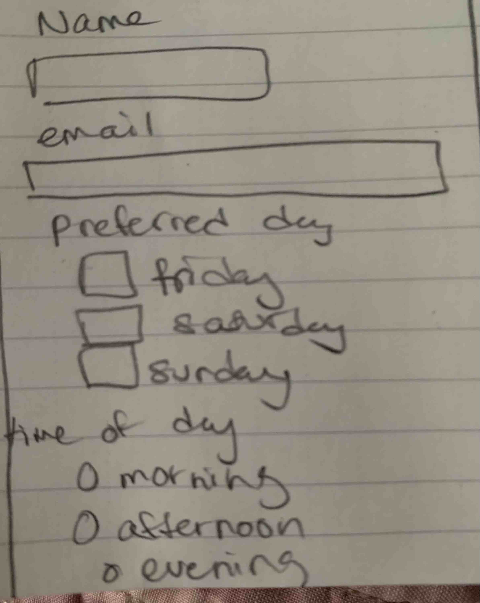
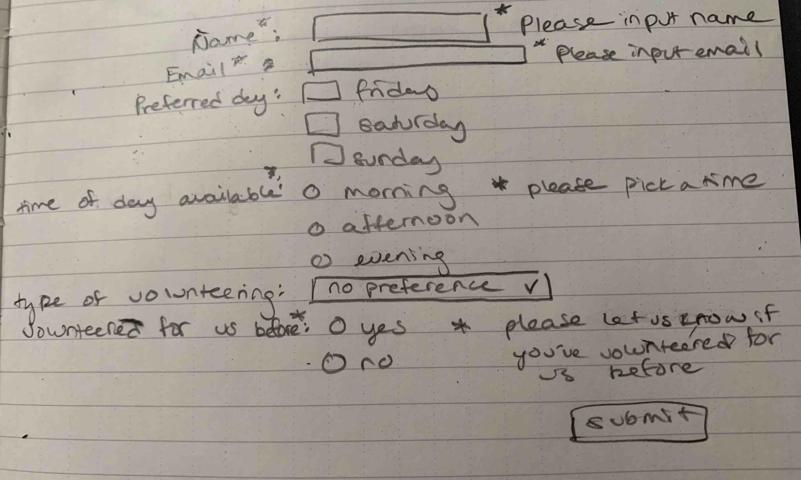
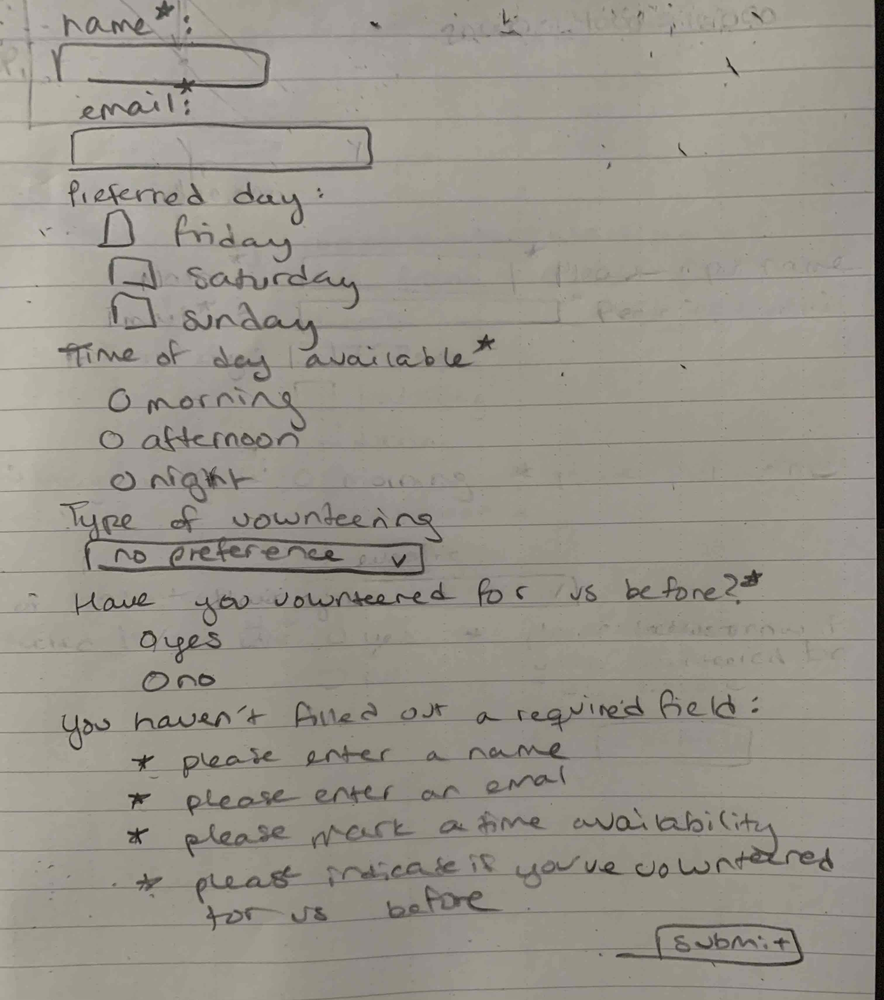

# Project 3: Design Journey

**For milestones, complete only the sections that are labeled with that milestone.**

Be clear and concise in your writing. Bullets points are encouraged.

**Everything, including images, must be visible in Markdown Preview.** If it's not visible in Markdown Preview, then we won't grade it. We won't give you partial credit either.

**Make the case for your decisions using concepts from class, as well as other design principles, theories, examples, and cases from outside of class.**

You can use bullet points and lists, or full paragraphs, or a combination, whichever is appropriate. The writing should be solid draft quality but doesn't have to be fancy.

## Project 1 or Project 2
> Which project will you add a form to?

Project 2

## Audience (Milestone 1)
> Who is your site's target audience? This should be the original audience from Project 1 or Project 2. You may adjust the audience if necessary. Just make sure you explain your rationale for doing so here.

My audience is the same as project 2, which is the on the go Cornell student who needs to access information quickly, whether for themselves or to spread that information to others. I represented that audience with Cornell Visitor Relations, which to me is the perfect sample of students who, for their job, need to quickly access websites and digest the information in order to relay it back to a caller asking questions or other students. They represent the type of student who wants information quickly but also needs it in a very straight forward and mobile friendly format in case they're trying to access it on their phone on the way to the festival or rushing between classes.

## Audience's Needs (Milestone 1)
> List the audience's needs that you identified in Project 1 or 2. Just list each need. No need to include the "Design Ideas and Choices", etc. You may adjust the needs if necessary. However, any changes you make to the needs for this project should be clearly identified and justified.

- Accessibility
- Mobile compatibility
- Modern intuitive design
- Clearly labeled and structured information

## HTML Form + User Needs Brainstorming (Milestone 1)
> Using the audience needs you identified, brainstorm possible options for an HTML form for the site. List each idea and provide a brief rationale for how the HTML form addresses that need.

- Volunteering request form
  - Cornell students are for the most part pretty good people and my audience is for the proactive student that isn't just showing up at apple fest with their friends, this is the kind of student that is actively searching out information so I believe they would also be the kind of student that would want to help contribute and help the community. Additionally, they could have heard or wondered how they could give back and this would present a perfect opportunity.
- Raffle forms
  - All college students are broke so no student if presented with the opportunity would turn down the potential for free stuff. I think this would be a very appealing option and help encourage more student visitors to the festival if it comes with the promise of free stuff.

## HTML Form Proposal & Rationale (Milestone 1)
> Make a decision about your site's form. Describe the purpose of your proposed form for your Project 1 or 2 site. Provide a brief rationale explaining how your proposed form meets the needs of your site's audience.
> Note: If your form is a contact form, we expect to see a thorough justification explaining how a contact form addresses the user's _actual_ needs. In your justification explain how a contact form better suits the needs of your user compared to the alternatives (e.g. sending you an email using your email address).

Form Proposal: Volunteer Form

User Needs Rational: The type of Cornell student I described as my target audience is the vaguely type-A student who is actively seeking out information about the festival. I believe this student wants to learn about all aspects of the festival and how they can be involved in the process. I also think that having that form option would just generally encourage students to get involved in the community which is positive for all parties involved and works to draw together Ithaca's permanent residents and the seasonal college students and create better relations between the two groups.

## Form User Data (Milestone 1)
> Think through and plan the data you need to collect from the users. Do you need their name? Email address? etc.

- Name
- email
- Preferred days
- Times available
- type of Volunteering
- whether they've volunteered for the festival before
- Submit button

## Form Components & Validation Criteria (Milestone 1)
> For each piece of data you plan to collect from the users, identify an appropriate HTML component to collect that data and decide the validation criteria (e.g. whether this data is _required_). Briefly explain your reasoning for the component choice and the validation criteria.

- Name (required): text field; `<input type="text">`
  - the volunteer needs to be known/accounted for
-  Email (required): text field; `<input type="email">`
  - the volunteer needs to be contacted
- Type of volunteering (optional): dropdown; `<select>`
  - type of volunteering they want to do, defaults to no preference so it is not required to pick anything specific
- Whether they've volunteered for the festival before (required): radio buttons `<input type="radio">`
  - helps inform whether they need to be fully trained or not, so it is required to specify whether they've previously worked for the festival
- Preferred days (optional): checkboxes; `<input type="checkbox">`
  - no need to mark a preference, otherwise there will just be a default time
- Time of day available (required): radio buttons `<input type="radio">`
  - volunteer needs to select the time frame in which they are available to assist

## Form Location (Milestone 1)
> Which HTML file will you place your form?

  form.html

> Sketch the location of the form in that page. This sketch need not be fancy. You don't need to provide many details of the page or form. Just plan the location of the form on the page and communicate that to us. You can literally have a box that says "FORM HERE."

**Desktop Location**

**Mobile Location**

## Form Design (Milestone 1)
> Include sketches on your form below. Include sketches of your **mobile and desktop** versions without corrective feedback. Show us the evolution of your design and the alternatives you considered.

**Desktop Sketches**

I made a few designs with different alignments for the desktop version. I decided I preferred the third design because it follows the diagonal visual flow of how a reader reads a webpage. Therefore it makes the most sense to put the shortest elements at the top and the longest ones at the bottom so that the reader flows from top left to bottom right, ending with a bottom right submission button.

**Mobile Sketches**

## Form Feedback Design (Milestone 1)
> Include sketches of your **mobile and desktop** with _corrective feedback_. Show us the evolution of your design and the alternatives you considered.

**Desktop Feedback**

Two different feedback styles with similarly implemented mobile forms.

**Mobile Feedback**

I decided to go with the feedback that aligns with the element where there is an error instead of listing the errors at the bottom.

## Form Implementation Planning (Milestone 1)
> What submission method will your form use? GET or POST. Explain your reasoning.

POST because we're using private data (people's email address) so that information remains private and isn't in the URL.

> For your site's `<form>` element, plan all HTML attributes that you will need and their values. Hint: action=, method=, novalidate

- `method="post"`
- `action="https://www.cs.cornell.edu/courses/cs1300/2020fa/submit.php"`
- `novalidate`

## Additional Information (Milestone 1)
> (optional) Include any additional information, justifications, or comments we should be aware of.

TODO

## Plan Validation Pseudocode (Final Submission)
> Write your form validation pseudocode here.

When form is submitted:

  if name component is valid:
    hide name feedback
  else:
    show name feedback "Please enter a valid name."

  if email component is valid:
    hide email feedback
  else:
    show email feedback "Please enter a valid email address."

  if previous experience component is valid:
    hide previous experience feedback
  else:
    show previous experience feedback "Please indicate whether you have volunteered for us before. "

  if time of day component is valid:
    hide time feedback
  else:
    show time feedback "Please select a preferred time."

  if user data is invalid (not all previous components are valid):
    show feedback messages
  else:
    send data to server

## Additional Design Justifications (Final Submission)
> If you feel like you haven’t fully explained your design choices in the final submission, or you want to explain some functions in your site (e.g., if you feel like you make a special design choice which might not meet the final requirement), you can use the additional design justifications to justify your design choices. Remember, this is place for you to justify your design choices which you haven’t covered in the design journey. Use it wisely. However, you don’t need to fill out this section if you think all design choices have been well explained in the final submission design journey.

While the order of the elements of the form are debatable, I chose the order I ended up implementing because it most adheres to the instinct of the arching pattern of scanning. Therefore, the ordering of the elements was done so the user can best follow their standard scanning patterns in conjunction with my form design.

## Self-Reflection (Final Submission)
> This was the first project in this class where you coded some JavaScript. What did you learn from this experience?

I'd actually used JavaScript before so where I learned the most was about the interconnectiveness of the three languages and the functionality of each. I had used JavaScript but I couldn't say that I actually understood how it worked to combine with HTML and CSS. I really appreciate how straight forward Prof. Harms described how the three languages interact. I also appreciate how strict he was about styling rules and not imbedding languages, it made it very clear how each worked separately and how they shouldn't depend on each other.

> Reflect on how HTML, CSS, and JavaScript together support client-side interactivity. If it's helpful, you can describe your mental model of client-side interactivity or explain how the general idea of showing and hiding content can be used to implement other forms of client-side interactivity beyond form validation and feedback.

HTML establishes what can be displayed, such as certain images or text and CSS defines how that is styled, aka whether it is displayed or not. JavaScript is what changes the CSS in response to interaction from the user. Showing hidden content can also be useful like if a user scrolls over a certain part of a page, a paragraph description or a certain image appears which uses the same process of using JavaScript (on hover) to remove the .hidden CSS class from the image or paragraph element in the HTML.

> Take some time here to reflect on how much you've learned since you started this class. It's often easy to ignore our own progress. Take a moment and think about your accomplishments in this class. Hopefully you'll recognize that you've accomplished a lot and that you should be very proud of those accomplishments!

I've learned a lot! It had been a while since I last used HTML, CSS, and JS and I didn't use them to this extent. I feel like I learned a lot about the true functionality of the languages. My websites I made were far from perfect but they were pretty good! I think that's cool
